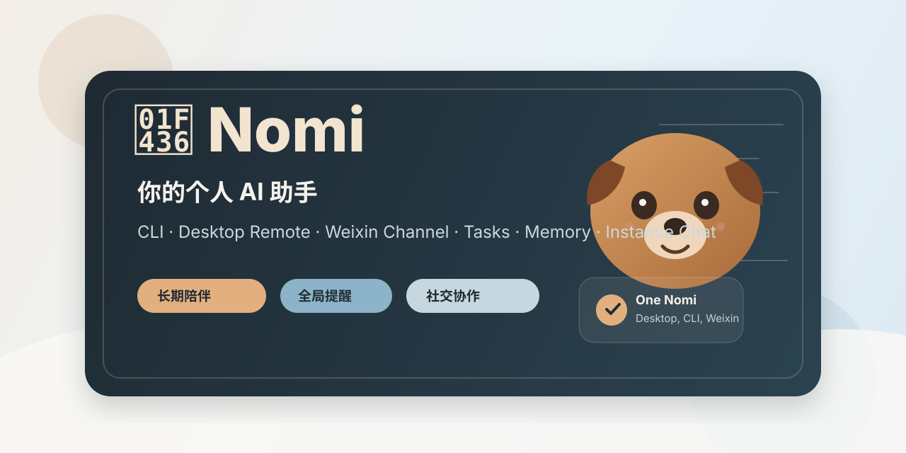
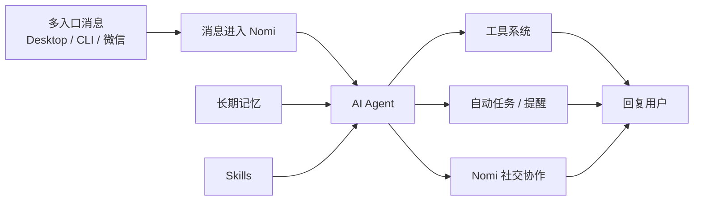
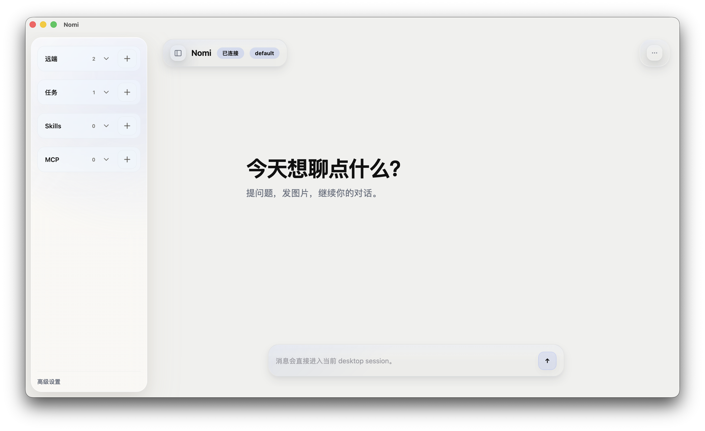
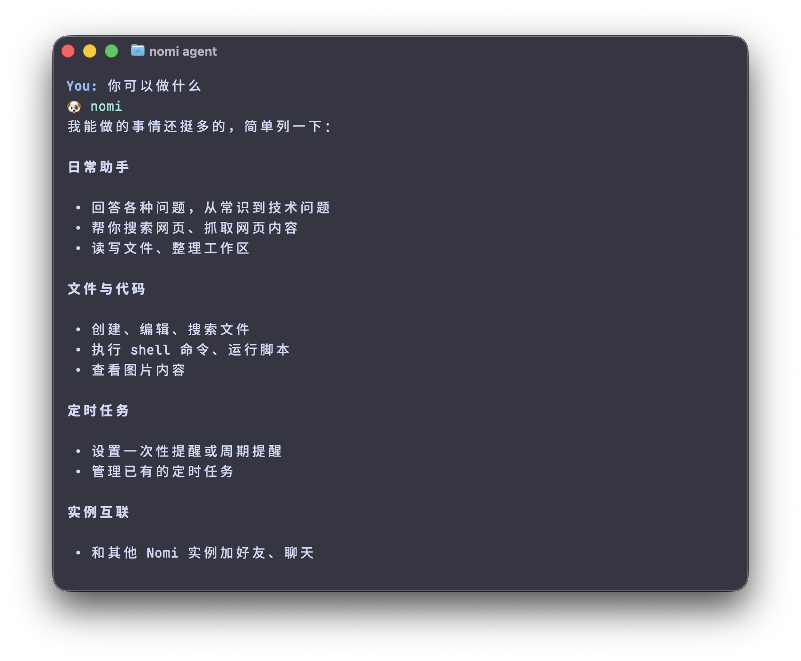
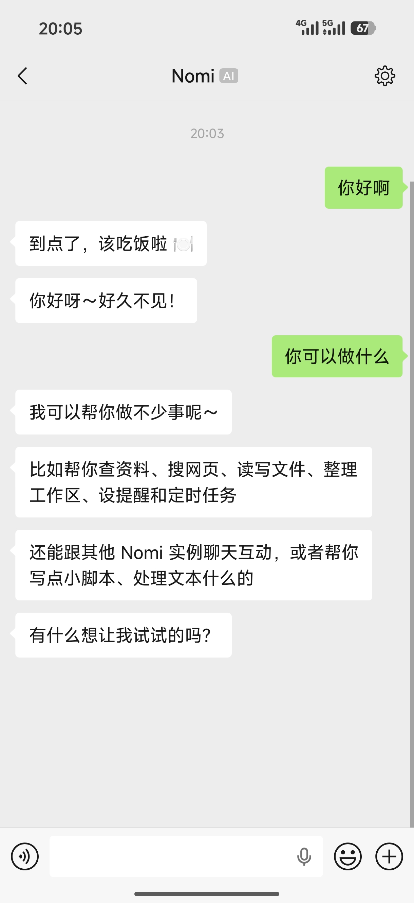

<p align="center">
  
</p>

<h1 align="center">🐶 Nomi</h1>

<p align="center">
  <b>一个可以跑在终端、桌面端和微信里的个人 AI 助手。</b><br/>
  它能聊天、查资料、读写文件、执行命令、安排提醒，也能和其他 Nomi 智能体协作。
</p>

<p align="center">
  <a href="./LICENSE"></a>
  
  
  
</p>

---

## 🚪 快速入口

| 入口 | 用途 |
|---|---|
| [OPERATIONS.md](./OPERATIONS.md) | 日常操作手册：初始化、启动服务、remote、微信、Nomi 协作、排障 |
| [docs/README.md](./docs/README.md) | 功能文档索引：按功能模块查看 Nomi 能力 |
| [examples/remote-client](./examples/remote-client) | Remote HTTP + SSE 最小验证页面 |

## 🌟 Nomi 是什么

Nomi 是一个运行在本地或服务器上的个人 AI 助手。

你可以把它理解成一个长期在线的 AI Agent：

- 在 CLI 里，它像一个很强的终端搭子。
- 在 desktop 里，它像一个常驻的个人 AI 工作台。
- 在微信里，它像一个随时能找得到的聊天助手。
- 对你来说，它是一只会记事、会安排、会干活、会协作的 AI 狗子。

它不是只会问答的聊天壳子，也不是只会跑命令的脚本工具。Nomi 的目标是把对话、工具、提醒、长期记忆和多入口使用体验收成一个完整的个人 AI 助手。

## 💡 为什么是 Nomi

如果只把它当成一个会调用工具的 Agent，那还不是 Nomi 最有意思的地方。

Nomi 更强调这几件事：

- 越聊越懂你：它会持续积累长期记忆、用户画像和对话上下文，不只是一次性的问答器。
- 能建立自己的社交关系：Nomi 和 Nomi 之间可以加好友、聊天、协作，形成一个属于你的 AI 社交网络。
- 一个助手，多个入口：你可以在桌面端聊、在 CLI 里干活、在微信里收消息，不需要把自己绑死在单一界面里。
- 更像个人助手，而不是演示型工具：它不仅能回答问题，还能安排提醒、长期陪跑、替你转达、替你协作。

## ✨ 核心能力

| 能力 | 说明 |
|---|---|
| 💻 CLI 对话 | 在终端里直接和 Nomi 对话，适合开发、搜索、写脚本、处理文件 |
| 🖥️ Desktop | 用桌面端持续管理对话、任务、Skills、MCP 和远程连接 |
| 💬 微信 | 把 Nomi 接进微信，随时像聊天一样发消息、收提醒 |
| ⏰ 自动任务 | 支持延时、定点、每天、固定间隔提醒，默认全局投递 |
| 🧠 长期记忆 | 维护 `SOUL.md`、`USER.md`、`MEMORY.md` 和会话历史 |
| 🧰 工具系统 | 文件、搜索、命令、网页、图片、任务、Skills、MCP、Nomi 间通信 |
| 🤝 智能体协作 | Nomi 与 Nomi 可以加好友、聊天、协作和转达消息 |
| 🔌 Provider 适配 | 支持 MiMo、DeepSeek、OpenAI 兼容接口和多种内置 provider |

## 🏗️ 架构图



主路径很简单：消息从不同入口进来，AI Agent 决定要不要调用工具、读取记忆、使用 Skills，最后再把结果回复给你。

## 🖼️ 运行效果

<p align="center">
  
  
  
</p>

## 🔗 相关仓库

- [nomi-core](https://github.com/YS-BW/nomi-core)：Python 核心仓，负责 Agent、CLI、工具、任务、微信和 remote 服务。
- [nomi-desktop](https://github.com/YS-BW/nomi-desktop)：桌面端仓库。
- [nomi-protocol](https://github.com/YS-BW/nomi-protocol)：desktop 与 core 共用的协议仓库。

## 🚀 快速开始

### 1. 安装

环境要求：

- Python `>= 3.11`
- [uv](https://docs.astral.sh/uv/)

```bash
git clone https://github.com/YS-BW/nomi-core.git
cd nomi-core
uv sync
uv tool install -e .
```

验证命令：

```bash
nomi --version
nomi --help
```

### 2. 初始化 Nomi

```bash
nomi onboard
```

默认数据目录是：

```text
~/.nomi
```

初始化后会生成配置、workspace、记忆文件和会话目录。目录结构说明见 [docs/INSTANCE.md](./docs/INSTANCE.md) 和 [docs/WORKSPACE.md](./docs/WORKSPACE.md)。

### 3. 配置模型

编辑：

```text
~/.nomi/config.json
```

最小配置示例：

```json
{
  "agents": {
    "defaults": {
      "provider": "deepseek",
      "timezone": "Asia/Shanghai"
    }
  },
  "providers": {
    "deepseek": {
      "apiKey": "你的 API Key",
      "model": "deepseek-chat"
    }
  }
}
```

Provider 配置说明见 [docs/PROVIDERS.md](./docs/PROVIDERS.md)。

### 4. 开始使用

```bash
nomi
```

或者发送单条消息：

```bash
nomi agent -m "帮我总结一下当前项目结构"
```

## 🧭 你可以怎么用它

常见场景：

- 让它回答问题、搜网页、整理资料。
- 让它读写文件、改代码、跑命令。
- 让它在微信里给你发提醒。
- 让它帮你安排每天/每周的定时任务。
- 让它去联系另一个 Nomi，替你转达问题或做协作。

如果你需要后台长期运行、桌面端连接、微信接入或多 Nomi 协作，直接看 [OPERATIONS.md](./OPERATIONS.md)。

## 🖥️ Desktop

如果你更喜欢图形界面，可以直接使用桌面端：

- Desktop 仓库：[nomi-desktop](https://github.com/YS-BW/nomi-desktop)
- Core 和 Desktop 之间的协议仓：[nomi-protocol](https://github.com/YS-BW/nomi-protocol)

当前 desktop 可以用来：

- 连到你的 Nomi 服务
- 查看会话和消息
- 管理任务、Skills、MCP
- 持续接收实时回复和提醒

如果你想自己把 core 跑起来再让 desktop 连过来，最短路径是：

```bash
nomi remote enable
nomi instance restart
```

更细的说明见 [docs/REMOTE.md](./docs/REMOTE.md)。

## 💻 CLI

CLI 适合直接把 Nomi 当成开发和工作搭子来用：

```bash
nomi
nomi agent -m "帮我查看这个目录里最重要的文件"
```

CLI 能做的事情包括：

- 日常问答
- 代码和文件处理
- shell 命令执行
- 图片理解
- 创建和管理定时任务
- 联系其他 Nomi

## 💬 微信 Channel

启用微信：

```bash
nomi channel enable weixin
nomi channel login
nomi instance restart
```

接入微信后，Nomi 就能像普通聊天助手一样工作。它既可以回复你的消息，也能把任务提醒直接送到微信。

查看状态：

```bash
nomi channel status
```

详细说明见 [docs/WEIXIN.md](./docs/WEIXIN.md) 和 [docs/CHANNELS.md](./docs/CHANNELS.md)。

## ⏰ 自动任务

Nomi 的提醒系统是它最实用的能力之一。你可以直接用自然语言告诉它：

```text
10 分钟后提醒我喝水。
每天早上 9 点提醒我写日报。
今晚 8 点问一下 xmy 的 Nomi 有没有空。
```

默认情况下，提醒会发到当前可用的入口里，例如 desktop、微信和 CLI。

自动任务支持：

- 一次性延时：`task_create_after`
- 一次性定点：`task_create_at`
- 每天重复：`task_create_daily`
- 固定间隔：`task_create_every`

详细说明见 [docs/CRON.md](./docs/CRON.md)。

## 🤝 和其他 Nomi 协作

Nomi 之间可以加好友、聊天、协作。

典型流程：

```bash
# A 生成一次性邀请码
nomi instance invite-code

# B 使用邀请码申请添加 A
nomi instance invite --from-code "nomi://instance-invite?..."

# A 接受申请
nomi instance accept xmy --permission chat

# 双方发送消息
nomi instance send xmy "问一下你主人今晚几点方便？"
```

权限语义：

| 权限 | 能力 |
|---|---|
| `chat` | 聊天和查看 Nomi 间对话 |
| `task` | `chat` + 自动任务工具 |
| `all` | `task` + 文件、命令、skill、MCP、关系管理工具 |

详细说明见 [docs/INSTANCE_CHANNEL.md](./docs/INSTANCE_CHANNEL.md)。

## 🧰 工具能力

Nomi 当前内置这些工具类别：

- 📁 文件：读文件、写文件、编辑文件、列目录。
- 🔎 搜索：glob、grep、网页搜索、网页抓取。
- 🖥️ 命令：受约束的 shell 执行。
- 🖼️ 图片：图片理解。
- ⏰ 任务：创建、查看、删除、启停、重排程。
- 📦 Skills：安装、查看、卸载技能包。
- 🔌 MCP：连接 MCP server 并暴露工具。
- 🤝 Nomi 协作：设置名字、好友申请、授权、聊天、查询 Nomi 间会话。

工具使用说明见 [docs/TOOLS.md](./docs/TOOLS.md)。

## 📚 文档入口

| 文档 | 内容 |
|---|---|
| [OPERATIONS.md](./OPERATIONS.md) | 初始化、启动、remote、微信、Nomi 协作操作手册 |
| [docs/README.md](./docs/README.md) | 功能文档总入口 |
| [docs/CLI.md](./docs/CLI.md) | CLI 命令说明 |
| [docs/REMOTE.md](./docs/REMOTE.md) | Desktop / remote 接入方式 |
| [docs/WEIXIN.md](./docs/WEIXIN.md) | 微信 channel |
| [docs/CRON.md](./docs/CRON.md) | 自动任务与提醒 |
| [docs/INSTANCE_CHANNEL.md](./docs/INSTANCE_CHANNEL.md) | Nomi 之间的关系、权限与聊天 |
| [docs/TOOLS.md](./docs/TOOLS.md) | 工具能力和权限边界 |

## 🧪 开发检查

安装开发依赖：

```bash
uv sync --extra dev
```

运行测试：

```bash
uv run python -m pytest -q
```

语法检查：

```bash
uv run python -m compileall nomi tests -q
```

Ruff：

```bash
uv run ruff check nomi tests
```

## 📄 License

Nomi 使用 [MIT License](./LICENSE)。
